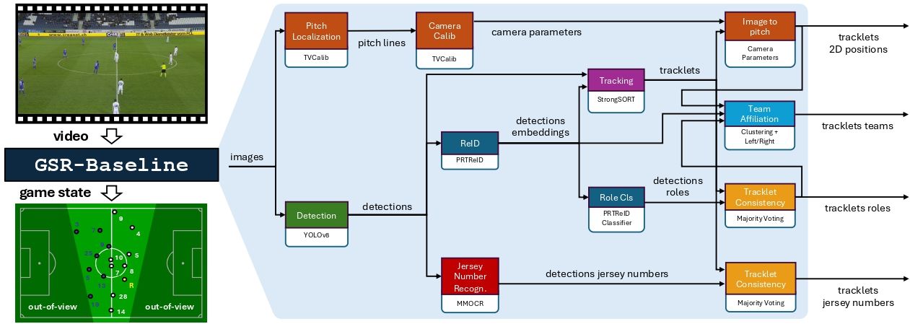

# SoccerNet Game State Reconstruction
## End-to-End Athlete Tracking and Identification on a Minimap

[[Paper](https://arxiv.org/abs/2404.11335)] [[Video](https://www.youtube.com/watch?v=UDeSdOR9Ing)] [[Demo](https://www.youtube.com/watch?v=0JRB7hjyOOk)] [[Tutorial](https://www.youtube.com/watch?v=Ir-6D3j_lkA)] [[Website](https://www.soccer-net.org/tasks/new-game-state-reconstruction)]

[](https://arxiv.org/abs/2404.11335) [](https://paperswithcode.com/sota/game-state-reconstruction-on-soccernet-gsr?p=soccernet-game-state-reconstruction-end-to)

>**[SoccerNet Game State Reconstruction: End-to-End Athlete Tracking and Identification on a Minimap, CVPRW'24](https://arxiv.org/abs/2404.11335)**
>
>Vladimir Somers, Victor Joos, Anthony Cioppa, Silvio Giancola, Seyed Abolfazl Ghasemzadeh, Floriane Magera, Baptiste Standaert, Amir Mohammad Mansourian, Xin Zhou, Shohreh Kasaei, Bernard Ghanem, Alexandre Alahi, Marc Van Droogenbroeck, Christophe De Vleeschouwer
>
>[*arxiv 2404.11335*](https://arxiv.org/abs/2404.11335)
>

Welcome to the SoccerNet Development Kit for the Game State task and Challenge.
This kit is meant as a help to get started working with the data and the proposed task.

The SoccerNet Game State Dev kit is built on top of [TrackLab](https://github.com/TrackingLaboratory/tracklab), a research framework for multi-object tracking.

⚽ 𝐖𝐡𝐚𝐭 𝐢𝐬 𝐒𝐨𝐜𝐜𝐞𝐫𝐍𝐞𝐭 𝐆𝐒𝐑?
SoccerNet Game State Reconstruction (GSR) is a novel computer vision task involving the 𝐭𝐫𝐚𝐜𝐤𝐢𝐧𝐠 and 𝐢𝐝𝐞𝐧𝐭𝐢𝐟𝐢𝐜𝐚𝐭𝐢𝐨𝐧 of players from a single moving camera to construct a video game-like 𝐦𝐢𝐧𝐢𝐦𝐚𝐩, without any specific hardware worn by the players.
👉 While this task holds immense value for the sports industry, there has been no appropriate open-source benchmark for method comparison until now!

🔎 𝐖𝐨𝐫𝐤 𝐇𝐢𝐠𝐡𝐥𝐢𝐠𝐡𝐭𝐬:
We introduce a new benchmark for Game State Reconstruction, including a new 𝐝𝐚𝐭𝐚𝐬𝐞𝐭 with 200 annotated clips and a new 𝐞𝐯𝐚𝐥𝐮𝐚𝐭𝐢𝐨𝐧 𝐦𝐞𝐭𝐫𝐢𝐜. Additionally, we release this 𝐜𝐨𝐝𝐞𝐛𝐚𝐬𝐞 which leverages various state-of-the-art deep learning methods to support further research on the task.

Participate in our upcoming Challenges during the [CVPR 2024 International Challenge at the CVSports Workshop](https://vap.aau.dk/cvsports/)! 
The participation deadline is fixed at the 30th of May 2024. 
The official challenge rules and submission instructions are available in [ChallengeRules.md](ChallengeRules.md). You can submit your predictions to the
[EvalAI evaluation server](https://eval.ai/web/challenges/challenge-page/2251/overview).


## 🚀 News

> [!IMPORTANT]
> We updated the annotations for the left/right team labels. Make sure you're at least on version
> 1.1 of the dataset. In Labels-GameState.json: "info" > "version" >= 1.1
>
> Current latest version : `1.2`

This codebase is still under active development, please make sure to come back regularly to get recent updates!
Do not forget to update both the sn-gamestate and tracklab repositories to the latest commits.
Feel free to open a GitHub issue or interact with us on our [official Discord channel](https://discord.com/invite/cPbqf2mAwF) if you encounter any issue: we will 
be happy to help with detailed instructions.

#### Upcoming
- [x] Release of the sn-gamestate repository
- [x] SoccerNet Game State Reconstruction dataset available for download
- [x] Complete baseline build with TrackLab available for participants
- [x] [EvalAI servers](https://eval.ai/web/challenges/challenge-page/2251/overview) open for evaluation
- [x] Further details provided about the new Game State Reconstruction evaluation metric
- [x] [Live tutorials on how to start with the challenge and the baseline](https://www.youtube.com/watch?v=Ir-6D3j_lkA&t=1553s)
- [x] Release of the [SoccerNet Game State Reconstruction paper](https://arxiv.org/abs/2404.11335) with detailed information about the task, dataset, baseline and evaluation metric.

#### Updates:
- [2024.04.25] Release of the baseline validation and test tracker states : https://zenodo.org/records/11065177
- [2024.03.27] Release of submission instructions in [ChallengeRules.md](ChallengeRules.md). 
- [2024.03.26] [EvalAI servers](https://eval.ai/web/challenges/challenge-page/2251/overview) open for evaluation
- [2024.03.21] V1.2 of the dataset released, with fixed left/right team labels
- [2024.02.13] Complete baseline released
- [2024.02.11] Dataset available for download
- [2024.02.05] Public release


### ⚽️ About the Game State Reconstruction Task
Game State Reconstruction can be seen as a compression task, where the goal is to extract high level information about a sport game given an input raw video.
The high level information to be extracted includes the following:
- The 2D position of all sports persons on the field
- Their role (player, goalkeeper, referee, other)
- For player and goalkeepers:
  - Their jersey number
  - Their team affiliation (i.e. left or right w.r.t. the camera viewpoint)

This high level information can be nicely displayed as a 2D minimap, or radar view, as shown in the GIF above.
Game State Reconstruction is a challenging task as it requires to solve several subtasks such as:
1. Pitch localization and camera calibration 
2. Person detection, re-identification and tracking 
3. Jersey number recognition 
4. Team affiliation

For more information, please have a look at our [introductory Youtube video](https://www.youtube.com/watch?v=UDeSdOR9Ing) and [more exhaustive tutorial](https://www.youtube.com/watch?v=Ir-6D3j_lkA&t=1553s).

### 🎯 About GS-HOTA: the Evaluation Metric for Game State Reconstruction
GS-HOTA is a novel evaluation metric to measure the ability of a GSR method to correctly track and identify all athletes on the sports pitch.
GS-HOTA is an extension of the HOTA metric, a popular evaluation metric for multi-object tracking.
To match ground truth and predicted bounding boxes in the image space, the standard HOTA metric uses an IoU-based similarity score.
The key distinction setting GS-HOTA apart from HOTA is the use of a new similarity score, that accounts for the specificities of the GSR task, i.e. the additional target attributes (jersey number, role, team) and the detections provided as 2D points instead of bounding boxes.
This new similarity score, denoted $Sim_{GS-HOTA}(P, G)$, is formulated as follows:
```math
Sim_{\text{GS-HOTA}}(P, G) = \text{LocSim}(P, G) \times \text{IdSim}(P, G)
```

```math
\text{with LocSim}(P, G) = e^{\ln(0.05)\frac{\|P - G\|_2^2}{\tau^2}}
```

```math
\text{and IdSim}(P, G) = 
\begin{cases} 
1 & \text{if all attributes match,} \\
0 & \text{otherwise.}
\end{cases}
```

$Sim_{\text{GS-HOTA}}$, is therefore a combination of two similarity metrics.
The first metric, the localization similarity $\text{LocSim}(P, G)$, computes the Euclidean distance $\|P - G\|_2$ between prediction P and ground truth G in the pitch coordinate system. 
This distance is subsequently processed using a Gaussian kernel with a special distance tolerance parameter $\tau$ set to 5 meters, resulting in a final score falling within the $[0, 1]$ range.
The second metric, the identification similarity $\text{IdSim}(P, G)$, is set to one only if all attributes match, i.e. role, team, and jersey numbers.
Attributes not provided in G are ignored, e.g. jersey numbers for referees.
GSR method must therefore output a 'null' team and jersey number attributes for non-player roles, as well as a 'null' jersey number when it is not visible in the video.
Finally, once P and G are matched, DetA and AssA are computed and integrated into a final GS-HOTA score, following the original formulation of the HOTA metric.
The GS-HOTA imposes therefore a very strict constraint on the predicted detections, since failing to correctly predict all attributes for a detection turns it into a False Positive.
We justify this strict constraint based on the severe impact that assigning localization data to an incorrect or nonexistent identity can have on downstream applications.
We refer readers to the official paper for detailed description and discussion about the GS-HOTA.

### 🏟️ About the Game State Reconstruction Baseline
For the purpose of this challenge, we use the [TrackLab framework](https://github.com/TrackingLaboratory/tracklab), an open-source modular tracking framework.
The [TrackLab repository](https://github.com/TrackingLaboratory/tracklab) contains all generic code related to multi-object tracking (object detection, re-identification, tracking algorithms, etc), whereas the [sn-gamestate repository](https://github.com/SoccerNet/sn-gamestate) contains the additional code specific to the SoccerNet Game State Reconstruction task (jersey number recognition, team affiliation, etc).
The diagram below represents the complete pipeline of the baseline.
TrackLab make it easy to add/customize/replace modules in the pipeline. 
This enables participants to focus on one or more specific subtask of the challenge, without worrying about other tasks.
We strongly encourage participants to analyse some videos to build a better intuition on which part of the pipeline should be improved.
We provide more technical details about all components of the baseline in the [SoccerNet Game State Reconstruction paper](https://arxiv.org/abs/2404.11335).



## Quick Installation Guide
This guide will tell you how to install the framework, download the dataset and all models weights, and run the baseline on a single video from the validation set.
Tracklab will create a `.mp4` video showcasing the game state reconstruction results under `output/{date}/{time}/visualization/videos/021.mp4` in your current working directory.

### 1. Installing TrackLab and the GameState baseline 
Before running the baseline for the first time, you will need to clone the project and setup the environment as described below.

#### Clone the repositories
First git clone this repository, and the [TrackLab framework](https://github.com/TrackingLaboratory/tracklab) *in adjacent directories* : 
```bash
mkdir soccernet
cd soccernet
git clone https://github.com/SoccerNet/sn-gamestate.git
git clone https://github.com/TrackingLaboratory/tracklab.git
```

> [!NOTE]
> If you are using an IDE (like PyCharm or VS Code), we suggest creating a single project with `soccernet` as root directory.
> Instructions : [PyCharm](https://www.jetbrains.com/help/pycharm/configuring-project-structure.html) and [VS Code](https://code.visualstudio.com/docs/editor/multi-root-workspaces)

#### Option 1: Install using Poetry
1. Install poetry : https://python-poetry.org/docs/#installing-with-the-official-installer
2. Install the dependencies : 
```bash
cd sn-gamestate
poetry install
poetry run mim install mmcv==2.0.1
poetry shell
```

To enter the virtual environment created by Poetry, you can either use `poetry shell`,
or prefix all commands by `poetry run`.

#### Option 2: Install using conda
1. Install conda : https://docs.conda.io/projects/miniconda/en/latest/
2. Create a new conda environment : 
```bash 
conda create -n tracklab pip python=3.10 pytorch==1.13.1 torchvision==0.14.1 pytorch-cuda=11.7 -c pytorch -c nvidia -y
conda activate tracklab
```
3. Install all the dependencies with : 
```bash
cd sn-gamestate
pip install -e .
pip install -e ../tracklab
mim install mmcv==2.0.1
```

#### Updating
Please make sure to check the official GitHub regularly for updates.
To update this repository to its latest version, run `git pull` on both repositories:
```bash
git pull
git -C ../tracklab pull
```

After updating, you should rerun the installation of the dependencies in case they are updated 
(either running `poetry install` or *both* `pip install`'s).

We will advertise big updates on the [soccernet discord](https://discord.com/invite/cPbqf2mAwF).

### 2. Downloading the Dataset and the Baseline Models Weights
#### Automatic download
Tracklab will automatically download the SoccerNet-gamestate dataset and all models' weights when you run the baseline for the first time.
If the script stopped before the download was completed, please delete the dataset folder and start from scratch to avoid any error.
If you choose this option, you can go directly to the next step.

#### Manual downloading of SoccerNet-gamestate
If you want to download the dataset manually, you can run the following snippet
after installing the soccernet package (`pip install SoccerNet`) : 

```
from SoccerNet.Downloader import SoccerNetDownloader
mySoccerNetDownloader = SoccerNetDownloader(LocalDirectory="data/SoccerNetGS")
mySoccerNetDownloader.downloadDataTask(task="gamestate-2024",
                                       split=["train", "valid", "test", "challenge"])
```

After running this code, please unzip the folders, so that the data looks like : 
```
data/
   SoccerNetGS/
      train/
      valid/
      test/
      challenge/
```

You can unzip them with the following command line : 
```bash
cd data/SoccerNetGS
unzip gamestate-2024/train.zip -d train
unzip gamestate-2024/valid.zip -d valid
unzip gamestate-2024/test.zip -d test
unzip gamestate-2024/challenge.zip -d challenge
cd ../..
```

### 3. Running the baseline on a single video
#### Setup

> [!NOTE]
> Tracklab uses the [Hydra](https://github.com/facebookresearch/hydra) configuration library.

You will need to set up some variables before running the code in [soccernet.yaml](sn_gamestate/configs/soccernet.yaml) :
- `data_dir`: the directory where you will store the different datasets (must be an absolute path !). If you opted for the automatic download option, `data_dir` should already point to the correct location.
- All the parameters under the "Machine configuration" header. For the corresponding modules :
  - The `batch_size` (lower these values if you encounter memory issues)
  - You might want to change the model hyperparameters
 
#### Command Line
Finally, run the SoccerNet Game State Reconstruction baseline with the following command :
```bash
python -m tracklab.main -cn soccernet
```
By default, this command will perform game state reconstruction on one SoccerNet validation sequence, display results in a .mp4 video saved on disk and print the final performance metric.
As a reminder, the dataset and all model's weights will be downloaded automatically on the first run.

You can find all possible configuration groups at the top when running the following command :  
```bash
python -m tracklab.main --help
```

You can have a look at the default parameters in [soccernet.yaml](sn_gamestate/configs/soccernet.yaml).

## Tutorials

### How to get started

We invite users to read carefully the following resources:
1. [TrackLab README](https://github.com/TrackingLaboratory/tracklab/blob/main/README.md) for further instructions about the framework.
2. [soccernet.yaml](sn_gamestate/configs/soccernet.yaml) for more information about the available configurations.
3. [Hydra's tutorial](https://hydra.cc/docs/tutorials/intro/) to better understand how to configure TrackLab. 

### Adding a new module

If you want to add a new module in the tracklab pipeline, you can either add it in this repository,
by adding code in (a new directory in) [sn_gamestate](sn_gamestate) and configuration files in 
[sn_gamestate/configs/modules](sn_gamestate/configs/modules), which will be added automatically. 

If you would like to create a separate project that makes use of tracklab, you will need to declare
the location of your config file using an [entry point](https://setuptools.pypa.io/en/stable/userguide/entry_point.html#entry-points-for-plugins).
The entry point group should be `tracklab_plugin` and it should point to a class containing a variable called `config_package`,
as shown [here](sn_gamestate/config_finder.py), this variable should point to the location of your configuration folder.
Temporarily, you can also specify a directory using Hydra's `--config-dir`.

### Downloading the baseline's Tracker States
The Tracker State is where Tracklab saves all tracking predictions, i.e., all detections and their information, such as bounding box, reid embeddings, jersey number, track ids, etc.
A Tracker State can be saved to disk and loaded back to save computation time on the next run.
Please have a look at the [Tracklab Tutorial on using Tracker States](https://github.com/TrackingLaboratory/tracklab?tab=readme-ov-file#dump-and-load-the-tracker-state-to-save-computation-time) for more information.
We provide the Tracker State of the baseline for the [validation set](https://zenodo.org/records/11065177/files/gamestate-prtreid-strongsort-valid-compressed.pklz?download=1) and the [test set](https://zenodo.org/records/11065177/files/gamestate-prtreid-strongsort-test-compressed.pklz?download=1) on [Zenodo](https://zenodo.org/records/11065177).

## Troubleshooting
If you encounter issues after upgrading to the latest version, do not forget to run `poetry install`  or `pip install -e .` and `pip install -e ../tracklab` to keep your environment up to date.
Feel free to open a GitHub issue or contact us on Discord if you need further assistance.

### FAQ
We will try to gather interesting questions and answer them in the [FAQ](FAQ.md).

## References

 - Bbox detection : YOLOv8 [[Code](https://github.com/ultralytics/ultralytics)]
 - Re-Identification : PRTReid [[Paper](https://arxiv.org/abs/2401.09942)] [[Code](https://github.com/VlSomers/Prtreid)] | BPBreID [[Paper](https://arxiv.org/abs/2211.03679)][[Code](https://github.com/VlSomers/bpbreid)]
 - Camera calibration & field localisation : TVCalib [[Paper](https://arxiv.org/abs/2207.11709)] [[Code](https://github.com/MM4SPA/tvcalib/tree/main)]
 - Jersey number recognition : MMOCR [[Paper](https://arxiv.org/abs/2108.06543)] [[Code](https://github.com/open-mmlab/mmocr)]

## Citation
If you use this repository for your research or wish to refer to our contributions, please use the following BibTeX entries:

[SoccerNet Game State Reconstruction](https://arxiv.org/abs/2404.11335):
```
@inproceedings{Somers2024SoccerNetGameState,
        title = {{SoccerNet} Game State Reconstruction: End-to-End Athlete Tracking and Identification on a Minimap},
        author = {Somers, Vladimir and Joos, Victor and Giancola, Silvio and Cioppa, Anthony and Ghasemzadeh, Seyed Abolfazl and Magera, Floriane and Standaert, Baptiste and Mansourian, Amir Mohammad and Zhou, Xin and Kasaei, Shohreh and Ghanem, Bernard and Alahi, Alexandre and Van Droogenbroeck, Marc and De Vleeschouwer, Christophe},
        booktitle = cvsports,
        month = Jun,
        year = {2024},
        address = city-seattle,
}
```

[TrackLab](https://github.com/TrackingLaboratory/tracklab):
```
@misc{Joos2024Tracklab,
	title = {{TrackLab}},
	author = {Joos, Victor and Somers, Vladimir and Standaert, Baptiste},
	journal = {GitHub repository},
	year = {2024},
	howpublished = {\url{https://github.com/TrackingLaboratory/tracklab}}
}
```

[PRTReid](https://arxiv.org/html/2401.09942v1):
```
@inproceedings{Mansourian2023Multitask,
	title = {Multi-task Learning for Joint Re-identification, Team Affiliation, and Role Classification for Sports Visual Tracking},
	author = {Mansourian, Amir M. and Somers, Vladimir and De Vleeschouwer, Christophe and Kasaei, Shohreh},
	booktitle = mmsports,
	shortjournalproceedings = {Proc. 6th Int. Work. Multimedia Content Anal. Sports},
	pages = {103–112},
	month = Oct,
	year = {2023},
	publisher = {ACM},
	address = city-ottawa,
	doi = {10.1145/3606038.3616172},
	url = {https://doi.org/10.1145/3606038.3616172}
}
```
