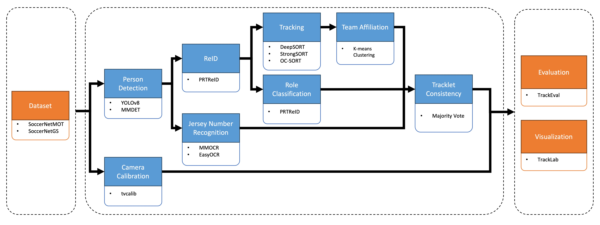

# SoccerNet Game State Challenge

Welcome to the SoccerNet Development Kit for the Game State task and Challenge.
This kit is meant as a help to get started working with the data and the proposed task.

The SoccerNet Game State Recognition task is a novel high level computer vision task that is specific to sports analytics.
It aims at recognizing the state of a sport game, i.e., identifying and localizing
all sports individuals (players, referees, ..) on the field based on a raw input videos. More information about the task and the dataset can be found on our [official website](https://www.soccer-net.org/).


Participate in our upcoming Challenges during the [CVPR 2024 International Challenge at the CVSports Workshop](https://vap.aau.dk/cvsports/)! 
The participation deadline is fixed at the 30th of May 2024. 
The official rules and guidelines are available in [ChallengeRules.md](ChallengeRules.md).

## 🚀 News
This codebase is still under active development, please make sure to come back regularly to get recent updates!
The complete code for running the baseline pipeline will be released soon.
Feel free to open a GitHub issue or interact with us on our [official Discord channel](https://discord.com/invite/cPbqf2mAwF) if you encounter any issue: we will 
be happy to help with detailed instructions.

#### Upcoming
- [x] Release of the sn-gamestate repository
- [x] SoccerNet Game State Reconstruction dataset available for download
- [x] Complete baseline build with TrackLab available for participants
- [ ] EvalAI servers open for evaluation and further details provided about the new Game State Reconstruction evaluation metric
- [ ] Live tutorials on how to start with the challenge and the baseline

#### Updates:
- [2024.02.05] Public release


## GameState Baseline
For the purpose of this challenge, we use the [TrackLab framework](https://github.com/TrackingLaboratory/tracklab), an open-source modular tracking framework. In the diagram below, you can see how each part of the framework is replaceable with different options thanks to TrackLab. This helps you be in charge of which task of the challenge you want to improve without worrying about other tasks.


## Installing TrackLab and the GameState baseline 
First git clone this repository, and the [TrackLab framework](https://github.com/TrackingLaboratory/tracklab) *in adjacent directories* : 
```bash
mkdir soccernet
cd soccernet
git clone https://github.com/SoccerNet/sn-gamestate.git
git clone https://github.com/TrackingLaboratory/tracklab.git
```

> [!NOTE]
> If you are using an IDE (like PyCharm or VS Code), we suggest creating a single project with `soccernet` as root directory.
> Instructions : [PyCharm](https://www.jetbrains.com/help/pycharm/configuring-project-structure.html) and [VS Code](https://code.visualstudio.com/docs/editor/multi-root-workspaces)

### Install using Poetry
1. Install poetry : https://python-poetry.org/docs/#installing-with-the-official-installer
2. Install the dependencies : 
```bash
cd sn-gamestate
poetry install
poetry run mim install mmcv==2.0.1
poetry shell
```

To enter the virtual environment created by Poetry, you can either use `poetry shell`,
or prefix all commands by `poetry run`.

### Install using conda
1. Install conda : https://docs.conda.io/projects/miniconda/en/latest/
2. Create a new conda environment : 
```bash 
conda create -n tracklab pip python=3.10 pytorch==1.13.1 torchvision==0.14.1 pytorch-cuda=11.7 -c pytorch -c nvidia -y
conda activate tracklab
```
3. Install all the dependencies with : 
```bash
cd sn-gamestate
pip install -e .
pip install -e ../tracklab
mim install mmcv==2.0.1
```

### Updating

Update this repository by running `git pull` on both repositories:
```bash
git pull
git -C ../tracklab pull
```

After updating, you should rerun the installation of the dependencies in case they are updated 
(either running `poetry install` or *both* `pip install`'s).

We will advertise big updates on the [soccernet discord](https://discord.com/invite/cPbqf2mAwF).

### Setup

> [!NOTE]
> Tracklab uses the [Hydra](https://github.com/facebookresearch/hydra) configuration library.

You will need to set up some variables before running the code :

1. In [soccernet.yaml](sn_gamestate/configs/soccernet.yaml) :
   - `data_dir`: the directory where you will store the different datasets (must be an absolute path !). By default
      this path points to a "data" folder that is inside the directory where you run the `tracklab` command.
   - All the parameters under the "Machine configuration" header
2. For the corresponding modules :
   - The `batch_size` (lower these values if you encounter memory issues)
   - You might want to change the model hyperparameters

## Manual downloading of SoccerNet-gamestate
> [!NOTE]
> If you use the sn-gamestate baseline, the dataset will download automatically
> on first use. No need to download it manually in that case.

If you want to download the dataset yourself, without using the baseline, you can run the following snippet
after installing the soccernet package (`pip install SoccerNet`) : 

```
from SoccerNet.Downloader import SoccerNetDownloader
mySoccerNetDownloader = SoccerNetDownloader(LocalDirectory="data/SoccerNetGS")
mySoccerNetDownloader.downloadDataTask(task="gamestate-2024",
                                       split=["train", "valid", "test", "challenge"])
```

After running this code, please unzip the folders, so that the data looks like : 
```
data/
   SoccerNetGS/
      train/
      valid/
      test/
      challenge/
```

You can unzip them with the following command line : 
```bash
cd data/SoccerNetGS
unzip gamestate-2024/train.zip -d train
unzip gamestate-2024/valid.zip -d valid
unzip gamestate-2024/test.zip -d test
unzip gamestate-2024/challenge.zip -d challenge
cd ../..
```


## Usage

run TrackLab on the command line with `tracklab` or `python -m tracklab.main`. All the additional
SoccerNet modules will be added automatically when installing this repository.

You can find all possible configuration groups at the top when running the following command :  
```bash
python -m tracklab.main --help
```

By default, tracklab will use generic defaults, in order to use the appropriate defaults for the
SoccerNet baseline, run it with :
```bash
python -m tracklab.main -cn soccernet
```

You can change the values of this config in [soccernet.yaml](sn_gamestate/configs/soccernet.yaml).
By default, this command will perform game state reconstruction on one SoccerNet validation sequence, display results in a .mp4 video saved on disk and print the final performance metric. 


## How to get started

We invite users to read carefully the following resources:
1. [TrackLab README](https://github.com/TrackingLaboratory/tracklab/blob/main/README.md) for further instructions about the framework.
2. [soccernet.yaml](sn_gamestate/configs/soccernet.yaml) for more information about the available configurations.
3. [Hydra's tutorial](https://hydra.cc/docs/tutorials/intro/) to better understand how to configure TrackLab. 

## Adding a new module

If you want to add a new module in the tracklab pipeline, you can either add it in this repository,
by adding code in (a new directory in) [sn_gamestate](sn_gamestate) and configuration files in 
[sn_gamestate/configs/modules](sn_gamestate/configs/modules), which will be added automatically. 

If you would like to create a separate project that makes use of tracklab, you will need to declare
the location of your config file using an [entry point](https://setuptools.pypa.io/en/stable/userguide/entry_point.html#entry-points-for-plugins).
The entry point group should be `tracklab_plugin` and it should point to a class containing a variable called `config_package`,
as shown [here](sn_gamestate/config_finder.py), this variable should point to the location of your configuration folder.
Temporarily, you can also specify a directory using Hydra's `--config-dir`.

## Troubleshooting
If you encounter issues after upgrading to the latest version, do not forget to run `poetry install`  or `pip install -e .` and `pip install -e ../tracklab` to keep your environment up to date.
Feel free to open a GitHub issue or contact us on Discord if you need further assistance.
